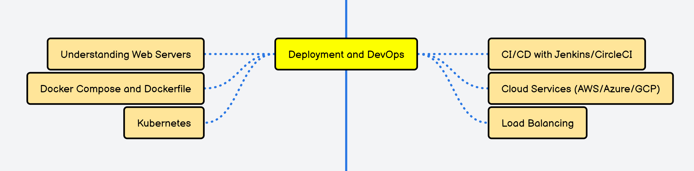

<h1>My Recommended Roadmap For Python Backend Developer Role :</h1>
  
<h1>Step 1</h1>

<h1>Step 2</h1>

<h1>Step 3</h1>

<h1>Step 4</h1>

<h1>Step 5</h1>

<h1>Step 6</h1>

<h1>Step 7</h1>

<h1>Step 8</h1>

<h1>Step 9</h1>

<h1>Step 10</h1>

<h1>Step 11</h1>

<h1>Step 12</h1>

<h1>Step 13</h1>

<h1>Step 14</h1>

<h1>Step 15</h1>

<h1>Step 16</h1>

