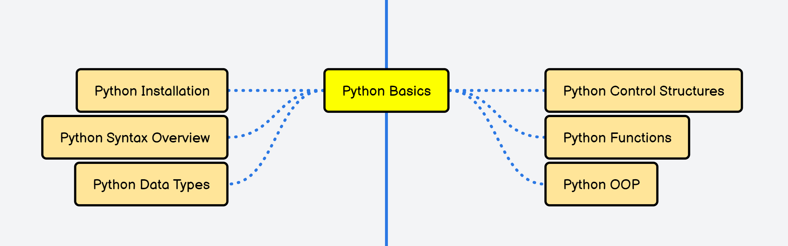

My Recommended Roadmap For Python Full Stack Developer Role :

 1. Step 1  2. Step 2   3. Step 3  4. Step 4  5. Step 5  6. Step 6  7. Step 7  8. Step 8  9. Step 9  10. Step 10  11. Step 11  12. Step 12  13. Step 13  14. Step 14  15. Step 15  16. Step 16
